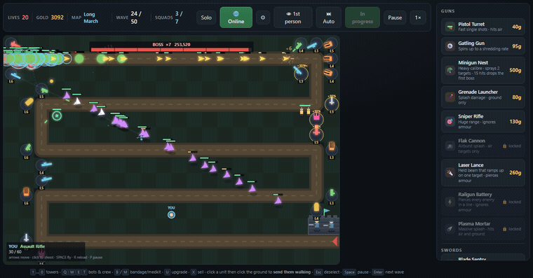
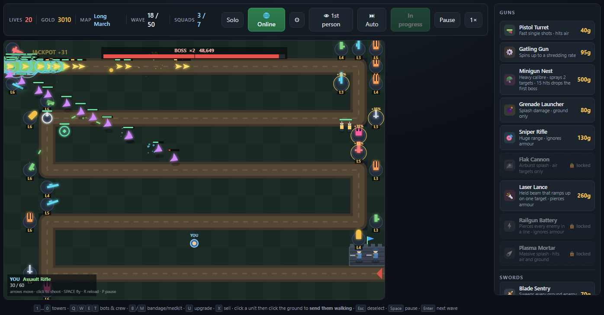
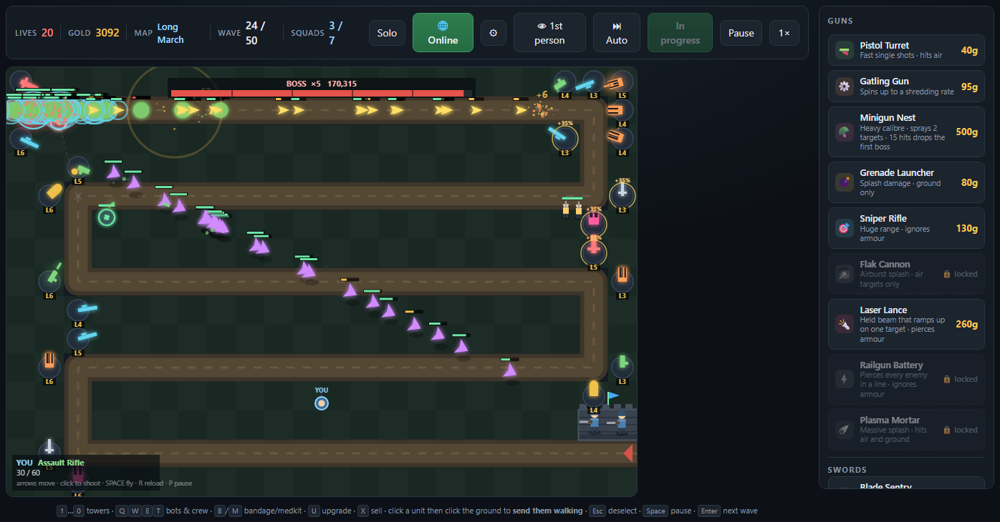
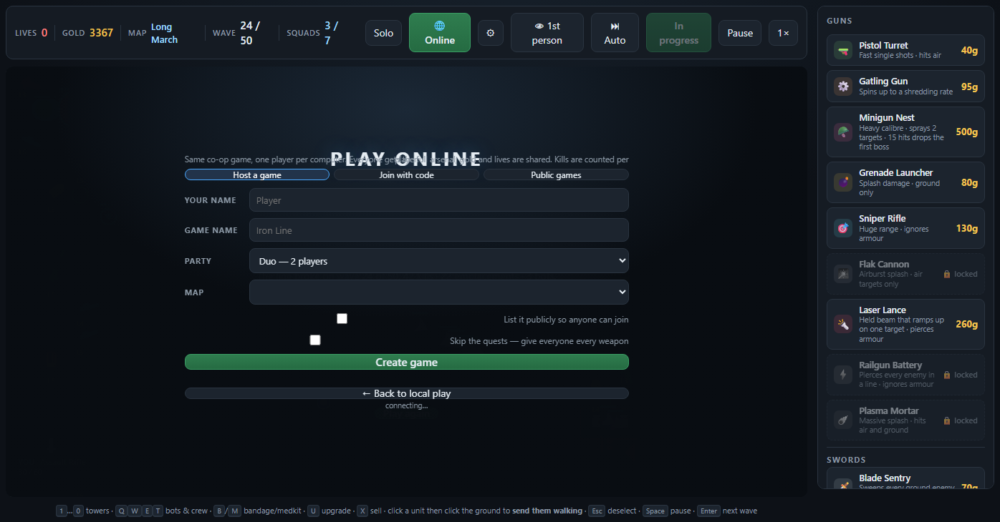
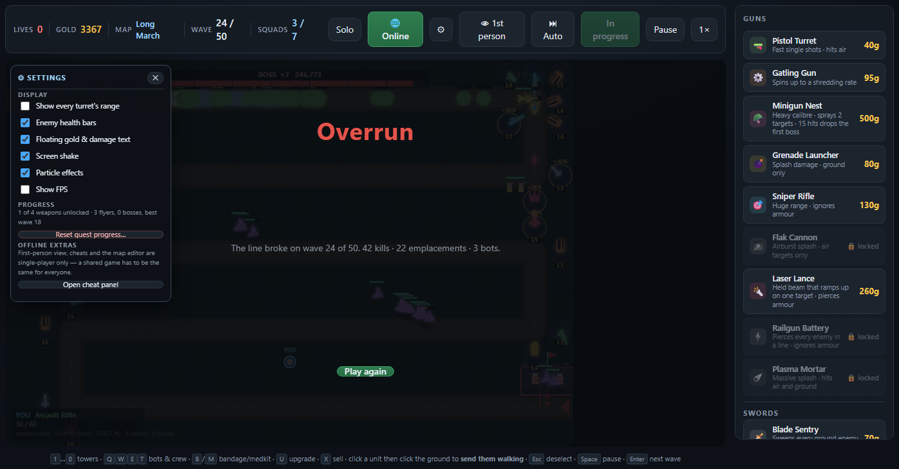

# Iron Line

A tower-defence game. Hold the road against fifty waves alone, or a hundred with
friends. Guns, steel, bots, and two nervous guards on the rampart.

**Play now → <https://buildwithsumit.com/ivaangames/>**

### 👉 New here? Read the [**Player's Guide**](GUIDE.md)

Everything below is the full reference — every stat, formula and rule. The guide
is the friendly version, written for someone picking the game up for the first
time.

Also runs with no server at all: download [iron-line.html](iron-line.html) and
open it. The whole single-player game is in that one file.



*Wave 24. Five bosses on the board, towers at level 3–6, and the line holding.*

---

## Contents

- [Features](#features) · [How to play](#how-to-play) · [Controls](#controls)
- [The board](#the-board) · [Lives](#lives) · [Gold](#gold)
- [Difficulty](#difficulty) · [Waves](#waves) · [Enemies](#enemies)
- [Towers](#towers) · [Bots](#bots) · [Medical](#medical)
- [Upgrading and selling](#upgrading-and-selling) · [Smart Upgrade](#-smart-upgrade) · [The turret allowance](#the-turret-allowance)
- [How to get better](#how-to-get-better) · [What unlocks when](#what-unlocks-when)
- [Quests](#quests-unlocking-the-heavy-weapons)
- [Multiplayer rules](#multiplayer-rules)
- [Maps](#maps) · [Settings](#settings) · [Full stat tables](#full-stat-tables)

---

## Features

- **11 turrets and 4 bots**, each with its own role — spinning miniguns, piercing
  railguns, splash mortars, sword sentries that sweep whole crowds, and walking
  robots you can order around the field
- **10 upgrade levels** per unit, compounding to roughly **33× the damage**
- **50-wave solo campaign**, or **100 waves** when you play with someone
- **Four difficulty tiers**, and waves that scale with your party size so co-op
  is a bigger fight rather than an easier one
- **A boss every wave from wave 5**, building to **10 bosses at once** — and three
  **Ultra Bosses** on the penultimate wave
- **Online co-op for 2–4 players** on separate computers, with a **shareable
  invite link**, in-game chat, and a public game browser
- **Per-player gold** — your guns earn your money — with **shared lives**, so you
  compete on the scoreboard and cooperate on survival
- **A quest system** that unlocks the four heavy weapons through play, with
  progress saved between runs
- **Six hand-built maps plus an infinite random map generator**, picked from
  thumbnails that draw each map's actual road
- **A turret allowance per player**, so you win by upgrading rather than sprawling
  — with **Build Permits** to turn a late-game fortune back into board space
- **🧠 Smart Upgrade** — an optimiser that spends your gold on whichever upgrade
  buys the most, weighing road covered, the next wave's air/ground mix, armour,
  and how much damage each of your units is *actually* dealing
- **Plays on phones and tablets** — drag to aim, lift to place, with the board
  pinned above the shop
- **Reconnect protection** — drop out and your seat and everything you built are
  held for 90 seconds
- **Runs offline from a single HTML file.** No install, no build step, no account

---

## Screenshots

### A wave in progress

Towers show their level. The bar across the top tracks the bosses still alive.
Green flashes are damage landing; the flag at the right is the keep you are
defending.

### A boss wave

From wave 5 every wave carries a boss, and more of them as you go. Flyers (the
purple arrowheads) cut straight across the map instead of following the road.

### The online lobby

Host a game, get a 5-letter code and a shareable link, or browse public games.

### The settings menu

Display options, quest progress, and — offline only — the cheat panel.

---

## How to play

Enemies walk a fixed road from the left edge to the right. You build turrets on
the ground beside it. Anything that reaches the far end costs you lives. Lose all
your lives and the run is over; clear every wave and you win.

Between waves there is a **15-second countdown**. You can build during it, or
call the wave in early for bonus gold.

### Three ways to play

| Mode | How | Waves |
|---|---|---|
| **Solo** | Just open the page | 50 |
| **Couch co-op** | 2–4 players, one keyboard, one screen | 50 |
| **Online co-op** | 2–4 players, separate computers | **100** |

**To play online:** click **🌐 Online** in the top bar → *Host a game* → pick a
party size and map → **Create game**. You get a 5-letter code and a shareable
link. Anyone who opens the link joins automatically. When everyone is seated, the
host clicks **Start the run**.

---

## Controls

| Action | Key / mouse |
|---|---|
| Pick a turret | `1`–`0`, or click it in the right panel |
| Pick a bot | `Q` `W` `E` `T`, or click it |
| Place what you picked | Click the board |
| Select a unit | Click it |
| Upgrade / sell | `U` / `X` |
| Send a bot somewhere | Select it, then click open ground |
| Buy bandage / medkit | `B` / `M` |
| Call the next wave early | `Enter` |
| Cancel a selection | `Esc` or right-click |
| Chat (online) | `T` |
| Pause / speed *(offline only)* | `Space` or `P` / the `1×` button |
| Smart Upgrade on/off | the **🧠 Smart Upgrade** button |

Couch co-op gives players 2–4 their own keyboard cluster and their own on-screen
cursor — the layouts are listed in the party lobby.

### Touch

| Action | Gesture |
|---|---|
| Aim | **Drag** — the build preview follows your finger |
| Place / select / order | **Lift** your finger |
| Everything else | Tap the on-screen buttons |

The preview matters more than it sounds: a touchscreen fires no `mousemove`, so
without it a tap places a turret blind — you cannot see which tile you are
buying, whether it is even legal, or what the range ring covers.

Below 980px the board and shop stack, and the board is **pinned to the top** so
the fight stays visible while you scroll the shop. Tap targets grow on coarse
pointers. First-person mode is hidden on touch-only devices, since it steers
with pointer lock and WASD.

---

## The board

22 × 15 tiles. The road is drawn in dirt; you **cannot build on it**, and you
cannot stack two turrets on one tile. Everything else is fair game.

Ground enemies follow the road exactly. **Flyers ignore it** and fly straight
across from entry to exit, so anti-air coverage has to be spread differently
from your ground defence.

At the right-hand end sits **the keep**, with two guards who fire for free all
game: 9 damage, 1.2 shots/second, 104 range. They will not save you, but they
chip in.

---

## Lives

You start with **20 lives**, and can hold at most **45**.

| What leaks through | Lives lost |
|---|---|
| Any normal enemy | 1 |
| A boss | 10 |
| An Ultra Boss | 25 |

At zero, the run ends. Lives are **shared by the whole team** in co-op — you hold
the line together or you lose together.

---

## Gold

You start with **250 gold**. In online co-op **every player has their own purse**,
and every purse starts at 250.

**Kill bounties are split across everyone whose guns hurt the thing, in
proportion to the damage each of them actually dealt.** Grind a boss down to a
sliver and you are paid for that work whether or not your shot lands last.

Only damage that actually landed counts — **overkill does not**. A railgun
finishing a grunt sitting on 10 health books 10 damage, not its full 1,200, so
it cannot walk off with a bounty the guns that did the real work had earned.

Damage dealt by the free keep guards belongs to nobody, so their share is spread
evenly across the party. The split uses largest-remainder rounding, so the parts
always sum to exactly the bounty — no gold is minted or lost.

> **Why it is not last-hit.** It used to be: whoever landed the killing blow
> took the whole bounty. That is arbitrary, and it rewards the wrong thing — a
> cheap fast turret standing beside a slow heavy one snipes its bounties, and a
> gun that does 95% of the damage to a boss can earn nothing at all.

**The scoreboard and quest progress follow the damage too**, going to whoever
did the most of it rather than to whoever fired last. A turret's own **Kills**
figure on the inspect panel still counts literal killing blows.

Bounties are not fixed. Each kill pays the enemy's base value **±35%**, and
**8% of kills pay a ×3 jackpot**. Enemy values also rise about **4% per wave**.

Two bonuses go to **every player** rather than to one earner:

- **Clearing a wave** — `(25 + 20 × wave) × 0.8–1.2` gold
- **Calling a wave early** — 3 gold for every second left on the countdown

Each player receives a **share**, not the full amount: the base is multiplied by
`partyScale(players) ÷ players`, then by the difficulty's income factor. A squad
of four faces 3.4× the enemies between the four of them, so each takes 3.4 ÷ 4 =
**0.85 of a solo bonus**. Paying everyone in full was half of why co-op used to
be a cheat code — four players collected four bonuses against a single wave.

| Party | Share each | Party total |
|---|---:|---:|
| Solo | ×1.00 | ×1.00 |
| Duo | ×0.90 | ×1.80 |
| Trio | ×0.87 | ×2.60 |
| Squad | ×0.85 | ×3.40 |

Calling waves in early is still the most reliable income in the game. If your
line is holding comfortably, it compounds fast.

---

## Difficulty

The host picks a tier when creating a game; solo players pick it in the lobby.

| Tier | Lives | Enemy health | Enemy count | Gold | For |
|---|---:|---:|---:|---:|---|
| **Recruit** | 25 | ×0.85 | ×0.92 | ×1.15 | Learning the maps |
| **Regular** | 20 | ×1.00 | ×1.00 | ×1.00 | The intended fight |
| **Veteran** | 16 | ×1.15 | ×1.08 | ×0.92 | Tighter economy, real pressure |
| **Iron** | 12 | ×1.32 | ×1.16 | ×0.84 | Every mistake costs the run |

### Co-op scales with the party

**More players means a bigger wave.** Each extra player adds **80% more
enemies** — a duo faces 1.8× a solo wave, a four-player squad 3.4×.

This is deliberate and it is the single most important balance rule in the game.
Every player has their own purse, so a four-player party has four economies. If
the wave did not grow with them, four players would bring four times the
firepower to an unchanged fight. Measured before this rule existed, a solo
player had 3.8× spare firepower on wave 1 and a four-player party had **18.5×** —
co-op was not co-operation, it was a cheat code.

Because bounties are paid per kill, more enemies also means proportionally more
gold. Each player ends up earning and facing roughly one solo game's worth.

Two details that keep it fair:

- **Wave length grows too.** Spawn gaps tighten by only the square root of the
  multiplier, so a bigger wave is partly more enemies and partly a longer wave.
  Scaling both together landed the whole wave as one unkillable blob.
- **Shared bonuses are shared.** Wave-clear and early-call bonuses pay each
  player a share matching the threat they carry, rather than paying everyone the
  full amount four times over.

Bosses scale more gently — 40% more per extra player rather than 80% — because
four times the bosses turns every wave into a boss rush.

### The first bosses are softened

A boss arrives every wave from wave 5, but the first ones come in at **45%
health**, ramping to full by wave 12. Wave 5 was the wall that ended almost
every measured solo run; the boss still shows up on schedule, it just is not an
instant loss before you have an economy.

---

## Waves

Wave composition grows on a fixed curve. Enemy health scales hard:

| Wave | Health multiplier | Bosses | Boss HP each | Armour bonus |
|---:|---:|---:|---:|---:|
| 1 | ×1.0 | — | — | +0 |
| 5 | ×3.2 | 1 | 3,850 | +0 |
| 10 | ×8.1 | 1 | 9,754 | +1 |
| 20 | ×25.2 | 2 | 30,202 | +3 |
| 30 | ×51.8 | 3 | 62,170 | +5 |
| 50 | ×133.9 | 5 | 160,666 | +8 |
| 75 | ×290.5 | 8 | 348,586 | +12 |
| 100 | ×507.1 | 10 | 608,506 | +16 |

- **Waves 1–4** are boss-free: grunts, then runners (2+), flyers (3+), tanks (4+).
- **From wave 5, every single wave carries a boss**, and one more boss is added
  every ten waves.
- **Enemy armour rises by 1 every 6 waves.** Armour subtracts flat damage from
  every hit, which is why armour-piercing weapons matter more the longer you go.
- **The penultimate wave** (49 solo, 99 in a party) brings **three Ultra Bosses**
  at 4.5× normal boss health. Survive it and the last wave is all that stands
  between you and the win.

---

## Enemies

| Enemy | Health | Speed | Armour | Bounty | Damage to bots | Notes |
|---|---:|---:|---:|---:|---:|---|
| **Grunt** | 58 | 52 | 0 | 6 | 9 | The bulk of every wave |
| **Runner** | 38 | 112 | 0 | 5 | 7 | Fast and fragile — leaks past slow defences |
| **Tank** | 300 | 34 | 4 | 17 | 28 | Armour makes weak rapid-fire useless |
| **Flyer** | 74 | 88 | 1 | 11 | — | **Ignores the road.** Needs anti-air |
| **BOSS** | 800 × curve | 29 | 7 | 220 | 75 | Costs 10 lives if it gets through |
| **ULTRA BOSS** | ×4.5 a boss | 21 | 18 | 3,000 | 220 | Three of them, once per run |

All values above are the base; multiply health by the wave curve and add the
wave's armour bonus.

---

## Towers

Eleven turrets. Four are locked behind [quests](#quests-unlocking-the-heavy-weapons).

### Guns

| Turret | Cost | Damage | Range | Rate | Hits air? | Notes |
|---|---:|---:|---:|---:|:---:|---|
| 🔫 **Pistol Turret** | 40 | 11 | 114 | 1.8/s | yes | Cheap, reliable opener |
| ⚙ **Gatling Gun** | 95 | 5.5 | 106 | 6.5/s | yes | **Spins up** — weak on first contact, shreds while held |
| 💣 **Grenade Launcher** | 80 | 27 | 130 | 0.62/s | **no** | 48 splash. Ground only |
| 🎯 **Sniper Rifle** | 130 | 84 | 266 | 0.42/s | yes | Enormous range, **ignores armour** |
| 🪖 **Minigun Nest** | 500 | 264 | 120 | 1.0/s | yes | Hits **2 targets at once** |
| 🎇 **Flak Cannon** 🔒 | 175 | 34 | 152 | 1.1/s | **air only** | 56 splash. Cannot touch ground units |
| 🔦 **Laser Lance** 🔒 | 260 | 13 | 150 | 6.0/s | yes | **Ramps up** while held on one target; ignores armour |
| ⚡ **Railgun Battery** 🔒 | 340 | 190 | 250 | 0.5/s | yes | **Pierces every enemy in a line**; ignores armour |
| ☄ **Plasma Mortar** 🔒 | 400 | 120 | 170 | 0.5/s | yes | 80 splash **and** slows by 25% |

### Swords

| Turret | Cost | Damage | Range | Rate | Notes |
|---|---:|---:|---:|---:|---|
| 🗡 **Blade Sentry** | 70 | 20 | 64 | 2.1/s | Sweeps **every** ground enemy in reach at once |
| ⚔ **Greatsword Guard** | 170 | 78 | 80 | 0.75/s | Heavy cleave, **slows survivors by 50%** |

Swords cannot hit air. They hit everything on the ground within range on every
swing, which makes them extraordinary against packed waves and poor against a
lone boss.

**Targeting:** turrets always shoot whichever valid enemy is **furthest along the
road**, not the nearest.

---

## Bots

Bots walk the field, take damage, die, and come back. You can order them anywhere
by selecting one and clicking open ground.

| Bot | Cost | Health | Damage | Range | Notes |
|---|---:|---:|---:|---:|---|
| 🤖 **Rifle Bot** | 95 | 130 | 10 @ 2.1/s | 138 | Shoots air and ground. Holds position |
| 🤺 **Blade Bot** | 125 | 290 | 18 @ 1.7/s | 30 | **Body-blocks** ground enemies — they stop and fight it |
| 🚑 **Medic Bot** | 145 | 170 | — | 125 | Repairs 22 hp/s to damaged bots nearby, including itself |
| 👥 **Gun Crew** | 165 | 200 | 7 @ 1.5/s | 114 | **Turrets within 114 fire 35% faster** |

**Rules that apply to all bots:**

- **Squad limit.** 6 bots at once, **+2 per extra player**, **+1 every 15 waves**.
- **Body-blocking.** A Blade Bot stops ground enemies in their tracks and trades
  blows. This is the single best way to buy time on a leaking lane.
- **Enemies hit harder every wave.** Melee damage scales with `√(hpScale)` —
  about **2.9× at wave 10, 6.1× at wave 25, 13.8× at wave 60**. A bot is a speed
  bump you rotate, not a wall you install once.

  > This used to be a flat constant for the entire game, and it was the single
  > biggest reason the late game had no teeth. A wave-60 boss shoved a Blade Bot
  > for the same 75 damage a second as a wave-5 boss, while the bot was level 10
  > with a Medic topping it up — so the arithmetic never closed and a blocking
  > bot became permanently unkillable. Measured: a maxed board took **zero leaks
  > all the way to wave 120**. Delete the bots from that same board and it
  > started leaking at wave 60. The bots were the whole story.
- **Self-repair.** Out of combat (no enemy within 165), a bot heals 5% of its max
  health per second.
- **Respawn.** A destroyed bot returns after **9 seconds** at the spot you last
  ordered it to, at full health. You do not pay again.
- **Gun Crew buffs do not stack** — only the best crew in range counts.

---

## Medical

| Item | Cost | Effect |
|---|---:|---|
| 🩹 **Bandage** | 35 | +3 lives |
| 🧰 **Medkit** | 90 | +9 lives |
| 📜 **Build Permit** | 3,000 | +1 turret slot (see [the allowance](#the-turret-allowance)) |

**Every medical purchase raises that item's price by 18%**, permanently for that
run. Buying lives is an emergency measure, not a strategy — at 1.08 a purchase a
rich player simply bought their lives back, and one real run regenerated from 13
lives to 45 while ignoring leaks entirely. Cap is 45 lives.

Permits escalate faster still, at **2.1× each**.

---

## Upgrading and selling

Everything can be upgraded to **level 10**.

**Per level, a turret gains:**

- **+46% damage** (compounding — level 10 is roughly **33× the damage** of level 1)
- +7% range (+5% for swords)
- +10% fire rate
- +6% splash radius, +4% slow

**Per level, a bot gains:** +38% health, +44% damage, +40% healing, +5% range,
+7% fire rate. Upgrading a live bot also heals it to full.

**Upgrade cost** rises steeply: `base cost × 0.78 × level^1.25`.

| | Lv 1→2 | Lv 2→3 | Lv 3→4 | Lv 5→6 | Lv 9→10 |
|---|---:|---:|---:|---:|---:|
| Pistol Turret | 31 | 74 | 123 | 233 | 486 |
| Railgun Battery | 265 | 631 | 1,047 | 1,983 | 4,134 |

> **The most important number in the game.** A level-10 pistol out-damages a
> level-1 railgun many times over for a fraction of the price. Concentrating gold
> into a few upgraded turrets beats spreading it across many cheap ones — right
> up until you need coverage somewhere new.

**Selling** returns **60% of everything you have put into a unit**, purchase
price plus every upgrade. Recalling a bot works the same way.

---

## 🧠 Smart Upgrade

A toggle in the top bar. While it is on, your gold is spent automatically on
whichever upgrade is worth the most at that moment — roughly three times a
second, per player, out of your own purse and onto your own units.

### What it optimises

Marginal value per gold. For every unit you own it evaluates what one more
level would add, divides by what that level costs, and buys the maximum. Never
absolute value, which would pour everything into whatever is already strongest.

A turret's value is modelled as the damage it expects to land on one enemy
walking past:

```
value = effective damage per second  ×  length of road it covers
```

Time-in-range is proportional to road covered, which is why the same sniper is
worth several times more on a hairpin than on a straight. The terms:

| Input | Effect |
|---|---|
| **Road covered** | Sampled every 10 px along the path. A turret nothing walks past scores zero and will never be upgraded. |
| **Ground vs air** | Ground enemies follow the road, flyers cut across it, so each is measured against its own path and weighted by what the **next wave** actually sends — by enemy *health*, not headcount, so one boss counts for more than a dozen runners. |
| **Armour** | Subtracted from every non-piercing hit, which quietly guts fast low-damage guns late. Piercing weapons ignore it. |
| **Splash, pierce, line, melee** | Fold into an effective target count — splash `1 + radius/50`, a railgun line ×4, a sweeping sword ×3. |
| **Spin-up** | A Gatling is discounted 25% for the shots it spends winding up. |
| **Measured performance** | Blended in at half weight: how much damage that exact unit has really dealt per gold sunk into it, this run. |

Bots are valued by their actual job — a Medic by what it keeps alive and how
many bots there are to patch, a Gun Crew by 35% of whatever turrets are standing
in range of it, a Blade Bot by the *time* its health buys against the wave's
melee damage.

### Why there is no neural network in here

Because it would be worse. "Which of my ~18 units takes the next upgrade" has a
well-defined objective, inputs the simulation already knows exactly, and a
search space small enough to evaluate exhaustively many times a second. A
learned model would be approximating a function we can simply compute — slower,
less accurate, and impossible to explain to a ten-year-old.

What it *does* do is learn in the sense that matters: the measured-performance
term is a feedback loop over the damage each unit is actually dealing. Theory
knows a turret's range and rate; only the measurement knows you tucked it behind
the keep. That correction is only possible because every unit now banks the
damage it deals — the same ledger the [gold split](#gold) runs on.

It is deliberately paced rather than run every tick: at 30 Hz it would empty a
purse the instant gold landed, which makes the gold counter unreadable and takes
the decision away from a player saving for a permit.

---

## The turret allowance

Each player may only have so many turrets standing at once. The current figure
is shown as **Turrets n / cap** in the top bar and turns red when you are full.

The allowance **grows with the wave** (+1 every 8 waves) and **shrinks with the
party size** — the road is the same length however many people are defending it.

| Party | Each player | Party total |
|---|---:|---:|
| Solo | 18 | 18 |
| Duo | 13 | 26 |
| Trio | 10 | 30 |
| Squad of four | 9 | 36 |

It is **flat across the whole run**, not something that opens up as you
progress. A growing allowance binds hardest at the start, which is exactly
backwards — the opening was never the problem. Telemetry has a real duo on 8–9
turrets each by wave 5, so a cap that started small would have squeezed their
first ten minutes to fix a fault that does not appear until wave 44. Flat means
it cannot bite until you can afford more than the limit, which is the late game
by construction.

### Why the limit exists

Escalating build prices were supposed to discourage sprawl on their own. They
did not, and the telemetry says why: a real 2-player run banked **217,040 and
462,110 gold** by wave 100. At that kind of money, a 40× price multiplier on a
40-gold pistol is pocket change. That pair finished on **112 turrets** and took
**zero leaks for the last 56 waves straight**, with lives pinned at maximum and
a board that had not changed since wave 60.

A price cannot bound a quantity when income is unbounded. Only a limit can.

Measured against a best-case board of maxed top-tier guns, the failure point now
lands where it belongs — at the end of the campaign, not never:

| Party | Board | First leak |
|---|---:|---:|
| Solo (50 waves) | 16 turrets | wave 80 — comfortably winnable |
| Duo (100 waves) | 22 turrets | wave 90 |
| Trio (100 waves) | 27 turrets | wave 100 |
| Squad (100 waves) | 32 turrets | wave 100 |

### 📜 Build Permits

A hard limit fixes the difficulty but leaves gold with nowhere to go, and dead
currency from wave 40 on is its own kind of broken — every kill stops meaning
anything. So the limit is a price, not a wall.

A **Build Permit** buys one extra turret slot. It lives in the Medical panel and
costs **3,000 gold**, with every subsequent permit costing **2.1× the last**:

| Permit | 1st | 2nd | 3rd | 4th | 5th | 6th | 7th |
|---|---:|---:|---:|---:|---:|---:|---:|
| Cost | 3,000 | 6,300 | 13,230 | 27,783 | 58,344 | 122,523 | 257,299 |

The sequence bounds itself. Six permits together cost 231,000 gold, and a
seventh alone costs more than most runs ever earn. A rich player buys a handful
of extra guns — not another fifty.

---

## How to get better

The game does not gate you behind menus — everything opens up through play. This
is roughly the order things click.

### Your first runs (waves 1–10)

Open with **Pistol Turrets** on the inside of the first few corners, where the
road doubles back. A turret on a bend covers the enemy twice.

**Wave 3 brings flyers**, and they ignore the road entirely — they fly straight
from the entry row to the exit row. If you have built everything in one corner,
they will sail past it. Keep something with `hits air` near the middle.

**Wave 5 is the first real test:** the first boss, arriving alongside ~40 other
enemies. Most first runs end here. Two things get you through it:

1. **Upgrade, don't sprawl.** Three level-4 turrets beat nine level-1 turrets for
   the same gold, and it isn't close.
2. **Buy a Blade Bot.** It body-blocks the boss and buys your turrets several
   free seconds of fire. 125 gold is cheap for that.

### Finding your economy (waves 10–25)

Once your line holds without babysitting, **call waves in early**. Three gold per
second left on the clock compounds into everything else you want to buy. Players
who clear the game are almost always the ones who stopped waiting out countdowns.

This is where **armour** starts to bite: it climbs by 1 every six waves and
subtracts flat damage from every hit. A Gatling Gun doing 5.5 per shot loses most
of its damage to a Tank's armour, while a Sniper — which ignores armour entirely
— does not care at all.

### The long game (wave 25+)

Late waves are about **splash and piercing**, not single-target damage. Twenty
enemies arrive at once and bosses stack up. Blade Sentries and Greatsword Guards
hit *everything* in range on every swing, which is why cheap swords stay relevant
next to a 400-gold mortar.

Add a **Gun Crew** next to your best cluster: a flat +35% fire rate on every
turret in range is usually better value than another turret.

### Playing together

Split the map, not the job. Two players each covering half the road with their
own upgraded turrets beats both of you crowding the same corner — you each have
your own purse to spend, and coverage is what kills you when it's missing.

---

## What unlocks when

Nothing is bought with real money and nothing is time-gated. Everything arrives
by playing.

| When | What you get |
|---|---|
| **Immediately** | Pistol, Gatling, Grenade Launcher, Sniper, Minigun, Blade Sentry, Greatsword Guard, and all four bots |
| **Wave 2** | Runners join the waves |
| **Wave 3** | Flyers — you now need anti-air |
| **Wave 4** | Tanks — armour starts mattering |
| **Wave 5** | The first boss. From here **every wave has one** |
| **Every 6 waves** | All enemies gain +1 armour |
| **Every 10 waves** | One more boss per wave |
| **Every 15 waves** | +1 to your squad limit |
| **120 flyers killed** | 🎇 **Flak Cannon** |
| **Reach wave 15** | 🔦 **Laser Lance** |
| **10 bosses killed** | ⚡ **Railgun Battery** |
| **Reach wave 30** | ☄ **Plasma Mortar** |
| **Wave 49 / 99** | Three Ultra Bosses |
| **Wave 50 / 100** | You win |

Quest progress is **cumulative across runs** — the flyers and bosses you killed
in a losing run still count. You are always making progress, even when you lose.

---

## Quests — unlocking the heavy weapons

Four turrets are locked. Each is earned by finishing a quest. **Progress is saved
on your own computer and carries across every run**, and there's a live progress
panel in the right-hand sidebar.

| Weapon | Quest | Goal |
|---|---|---|
| 🎇 **Flak Cannon** | *Ground the Flight* | Shoot down **120 flyers** (cumulative) |
| 🔦 **Laser Lance** | *Hold the Line* | Reach **wave 15** in a single run |
| ⚡ **Railgun Battery** | *Armour Piercing* | Destroy **10 bosses** (cumulative) |
| ☄ **Plasma Mortar** | *Scorched Earth* | Reach **wave 30** in a single run |

In online co-op **each player brings their own unlocks** — your grind arms you,
not the whole room. A host who would rather skip this can tick **"Skip the
quests"** when creating a game, which gives everyone everything.

---

## Multiplayer rules

Everyone shares one battlefield. What is shared and what is yours:

| | |
|---|---|
| **Shared** | The map, the wave, **lives**, the squad limit, the auto-wave setting |
| **Yours alone** | **Your gold**, your turrets and bots, **your turret allowance**, your quest unlocks |

**Ownership.** Anyone can build anywhere, but **only the owner can upgrade or
sell their own units**. Your gold pays for your line; nobody can cash out your
investment or spend your money.

**Kills are tracked per player** and shown on the scoreboard, so there are
bragging rights even though you win or lose together.

**Gold is split by damage dealt** — each kill pays every player in proportion to
what their guns actually did to that enemy, with overkill discounted and the
guards' share spread evenly. Bounties swing ±35% with an 8% chance of a triple
jackpot. Wave-clear and call-in-early bonuses go to every player, each scaled by
the threat they actually carry (`partyScale ÷ players`), so a squad of four does
not collect four bonuses against one wave. See [Gold](#gold) for the detail.

**Your turret allowance shrinks as the party grows** — see
[the turret allowance](#the-turret-allowance). More players means a bigger
fight, not an easier one.

**Seats.** Party size is fixed when the run starts, so a player going quiet never
reshuffles anyone else's game. Seat 1 is the host.

**If you disconnect,** your seat and everything you built are held for **90
seconds**. Reload the page and you drop straight back into the same run. If the
host leaves for good, the next connected player inherits the room so it can still
be started and restarted.

**Calling waves.** Anyone can call the next wave in early, and anyone can toggle
**⏭ Auto**, which skips every countdown from then on. Both apply to the whole
room — there is one clock and one wave.

**Not available online:** pause, fast-forward, the first-person view, and the
admin/cheat panel. Time belongs to the server when it is shared. All four still
work in offline solo play.

---

## Settings

The gear button opens settings, in every mode.

| Option | What it does |
|---|---|
| **Show every turret's range** | Draws all range circles at once — useful for spotting gaps |
| **Enemy health bars** | Turn off for a cleaner board |
| **Floating gold & damage text** | The `+13` numbers that pop off kills |
| **Screen shake** | Turn off if it bothers you |
| **Particle effects** | Turn off on a slow machine |
| **Show FPS** | Frame rate, and your ping when online |
| **Teammates' build cursors** | See what the others are lining up (online) |
| **Chat box on screen** | Hide the chat panel (online) |
| **Reset quest progress** | Clears counts and re-locks the four heavy weapons |

Choices are saved on your computer. **Offline only:** the same menu opens the
cheat panel, with free building, god mode, gold, wave jumping and map controls.
It is unavailable online, where a shared game has to be the same for everyone.

---

## Maps

Six hand-built maps — **Iron Line, Switchback, The Coil, Long March, Crossroads,
Hairpin** — plus a **freshly generated serpentine road** that is different every
time. Hosts pick one or leave it on *Surprise us*.

---

## Full stat tables

<details>
<summary><b>Formulas</b> (click to expand)</summary>

```
enemy health      base × (1 + 0.36(n−1) + 0.048(n−1)²)
boss health       800 × health multiplier × 1.5
ultra health      boss health × 4.5
enemy armour      base + floor(wave / 6)
enemy bounty      base × (1 + 0.04(n−1)) × (0.65–1.35) × (3 if jackpot, 8% chance)

damage dealt      max(1, damage − armour)        armour-piercing ignores armour

turret at level L dmg × 1.46^(L−1) · range × 1.07^(L−1) · rate × 1.10^(L−1)
bot    at level L hp × 1.38^(L−1) · dmg × 1.44^(L−1) · rate × 1.07^(L−1)

upgrade cost      base cost × 0.78 × L^1.25
sell refund       60% of total invested
medical cost      base × 1.08^(times bought this run)

squad limit       6 + 2×(players − 1) + floor(wave / 15)
wave clear bonus  (25 + 20 × wave) × 0.8–1.2
early call bonus  3 × seconds remaining
```

</details>

---

## For developers

The architecture, netcode and deployment are documented separately in
[MULTIPLAYER.md](MULTIPLAYER.md). In short: the client is one self-contained HTML
file, and online play is server-authoritative — a Node process runs the real
simulation at 30 Hz and broadcasts snapshots at 15 Hz, so no client ever decides
anything.

```bash
cd server && npm install
npm start                        # :8092

node test/smoke.js               # protocol, economy, quests, auto, reconnect
node test/abuse.js               # exploits, floods, malformed input
node test/deep-sim.js 4          # full campaigns, 1–4 players, invariant checks
node test/simulate.js 2          # multi-client network simulation
node test/soak.js 60             # bandwidth and tick health
node --expose-gc test/leak.js    # memory under churn and sustained load
```

## Licence

See [LICENSE](LICENSE).
